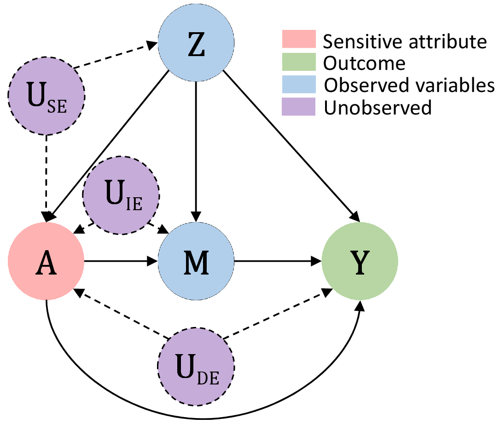
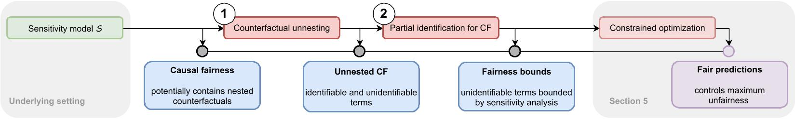

# FairSensitivityAnalysis

We provide this repository for reproducibility purposes of our paper **"Causal Fairness under Unobserved Confounding: A Neural Sensitivity Framework"** published at ICLR 2024 (https://arxiv.org/pdf/2311.18460.pdf).

The **folder structure** is as follows:
- data: Config files for generating the synthetic datasets as well as a dataframe containing the pre-processed real-world dataset. The original files are too large to be uploaded in this reporsitory. Please refer to https://www.icpsr.umich.edu/web/ICPSR/studies/37692/datadocumentation (data version DS0002) for downloading the original files.
- modules: Python scripts including the prediction models, helper functions for calculating the bounds, plotting and evaluation
- notebooks: Jupyter notebooks for data simulation, pre-processing and model training

**Abstract**:
Fairness of machine learning predictions is widely required in practice for legal, ethical, and societal reasons. Existing work typically focuses on settings without unobserved confounding, even though unobserved confounding can lead to severe violations of causal fairness and, thus, unfair predictions. In this work, we analyze the sensitivity of causal fairness to unobserved confounding. Our contributions are three-fold. First, we derive bounds for causal fairness metrics under different sources of unobserved confounding. This enables practitioners to examine the sensitivity of their machine learning models to unobserved confounding in fairness-critical applications. Second, we propose a novel neural framework for learning fair predictions, which allows us to offer worst-case guarantees of the extent to which causal fairness can be violated due to unobserved confounding. Third, we demonstrate the effectiveness of our framework in a series of experiments, including a real-world case study about predicting prison sentences. To the best of our knowledge, ours is the first work to study causal fairness under unobserved confounding. To this end, our work is of direct practical value as a refutation strategy to ensure the fairness of predictions in high-stakes applications.

